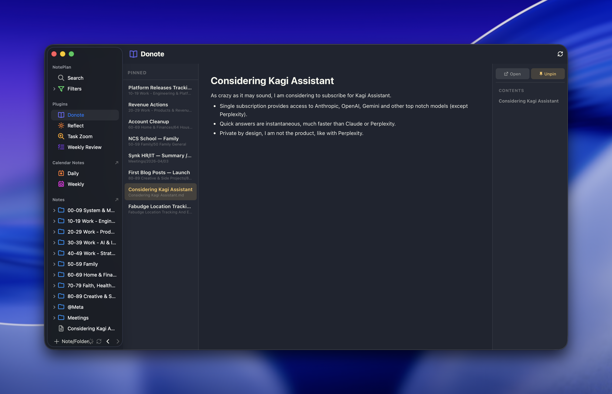

# Donote for NotePlan

A note viewer plugin for [NotePlan](https://noteplan.co) with a three-panel layout: pinned notes sidebar, full markdown rendering, and a table of contents with metadata. Read, review, and manage your notes without leaving the sidebar.



## Features

### Three-Panel Layout
- **Left sidebar** — pinned notes list, sorted by `pin: N` frontmatter value. Drag-and-drop to reorder.
- **Main content** — full markdown rendering of the selected note
- **Right sidebar** — table of contents with scroll spy, metadata display, and note actions

### Markdown Rendering
Comprehensive rendering of NotePlan's markdown syntax:
- Headings (h1-h6) with anchor links for TOC navigation
- Tasks (`- [ ]`, `- [x]`, `* [ ]`, `* text`) and checklists (`+ [ ]`, `+ [x]`, `+ text`, `+ [-]`)
- Task priorities (`!`, `!!`, `!!!`) with theme-derived colors
- Scheduled dates (`>2026-04-04`, `>2026-W14`, `>today`) as clickable badges
- Wiki links (`[[Note Name]]`) opening in NotePlan split view
- Web links, bold, italic, inline code, strikethrough, highlight (`==text==`)
- Hashtags and @mentions as clickable links (open NotePlan's tag/mention filter)
- Markdown tables, fenced code blocks with copy button, blockquotes
- Image attachments, horizontal rules, bullet and numbered lists
- Calendar event deeplinks (`![calendar-badge]`) rendered as visual badges
- Inline comments (`// comment`, `/* comment */`) rendered dimmed

### Task Management
- Click checkbox to toggle complete/incomplete
- Opt+click to cancel a task
- Hover actions: cycle priority, open calendar picker, cancel
- Priority cycling: none -> `!` -> `!!` -> `!!!` -> none
- Calendar picker with month navigation, week numbers (click to schedule by week), and day selection

### Task Filters
A smart filter bar appears at the top when the note contains tasks:
- **Status**: All, Open, Done, Cancelled — only shown if note has completed or cancelled items
- **Priority**: All, !!!, !!+, Any, None — only shown if note has prioritized items
- **Date**: All, No date, Overdue, Today, Overdue+Today — only shown if note has dated items
- Filters are saved per note in frontmatter and restored on revisit
- Filter bar updates dynamically after task mutations

### Metadata Display (Right Sidebar)
For notes with relevant frontmatter:
- **Date** — link to open the corresponding daily note
- **Attendees** — expandable count with email list (from meeting notes)
- **Recording** — button to open BlueDot recording URL

### Note Actions
- **Open** — open the note in NotePlan's split view
- **Pin/Unpin** — toggle pinning from within the viewer
- **`/Pin or unpin note for Donote viewer`** — command bar command to pin the current editor note

### Routine Integration
When completing or cancelling a task with `@repeat`, automatically invokes the [Routine](https://github.com/asktru/noteplan-routine) plugin to generate the next occurrence.

## Pinning Notes

Add `pin: N` to a note's YAML frontmatter to show it in the Donote sidebar:

```yaml
---
pin: 1
---
# My Important Note
```

Lower numbers appear first. You can also use the `/Pin or unpin note for Donote viewer` command from NotePlan's command bar, or the Pin/Unpin button in the right sidebar.

## Installation

1. Copy the `asktru.Donote` folder into your NotePlan plugins directory:
   ```
   ~/Library/Containers/co.noteplan.NotePlan*/Data/Library/Application Support/co.noteplan.NotePlan*/Plugins/
   ```
2. Restart NotePlan
3. Donote appears in the sidebar under Plugins

## Light and Dark Theme

Adapts to NotePlan's current theme automatically, including priority colors from the active theme's `flagged-1/2/3` styles.

## License

MIT
